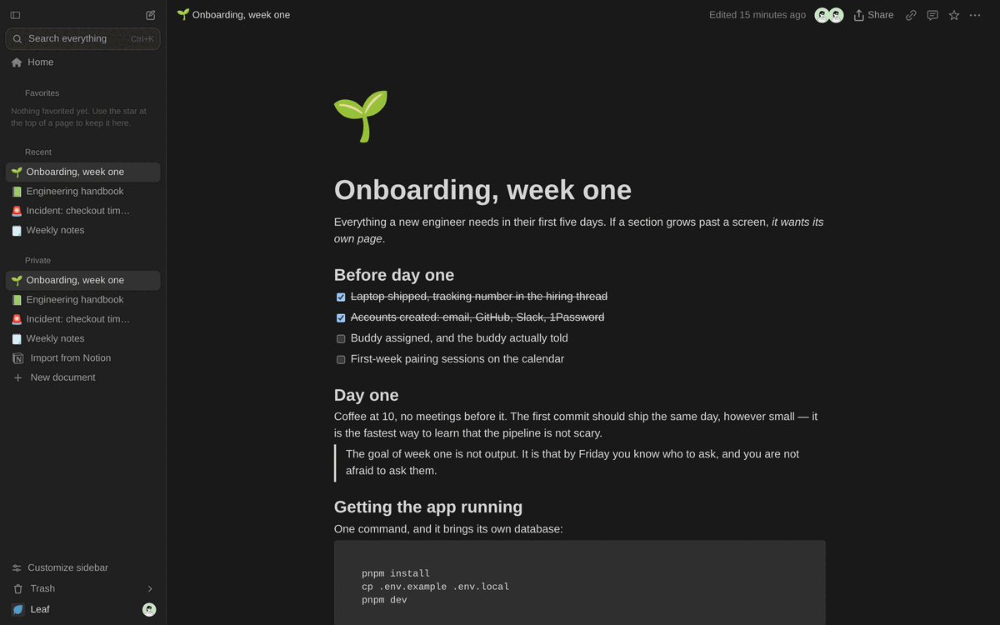
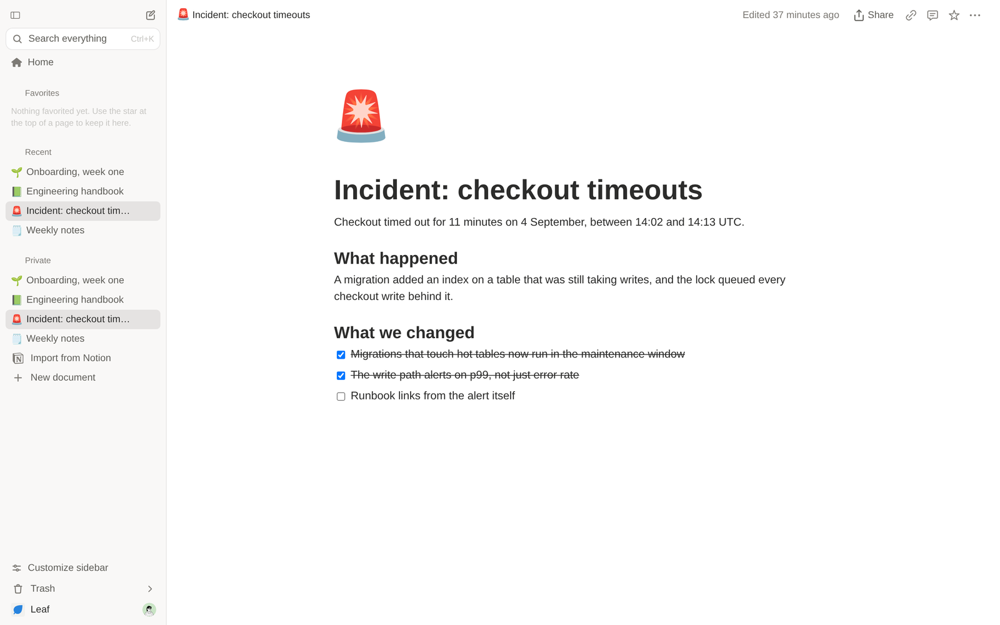

<div align="center">

<br>

# 🍃 &nbsp;Leaf

### The Notion-style workspace you can actually own

Blocks, nested pages, databases, real-time collaboration and instant search —
on your MySQL, in your cloud, under a licence that keeps it that way.

<br>

[](LICENSE)
[](https://nextjs.org)
[](https://react.dev)
[](https://dev.mysql.com)
[](docs/self-hosting.md)

<br>

<a href="docs/media/leaf-intro.mp4">
  
</a>

<br><br>

```bash
docker compose up
```

**That is the whole install.** Database, file storage and app on `localhost:3000`.

<br>

</div>

---

## Why Leaf

Teams leave Notion for one of three reasons: the documents are not theirs, the
bill grows with headcount, or the data cannot live outside the vendor. Leaf
answers all three — without asking anyone to give up the editor they got used
to.

**It is a real editor, not a markdown box.**
Slash menu, drag handles, nested pages, tables, embeds, comments anchored to
blocks, version history. Paste straight from Notion or Google Docs and the
formatting survives.

**Your Notion comes with you.**
Drop in an export zip and it becomes a page tree — images, internal links,
callouts and CSV databases converted. Or connect your account and import by
link, a page at a time or the whole workspace.

**It keeps working when the network does not.**
The open document lives in your browser and stays editable with no connection,
syncing on its own when the network returns. Not a spinner, not a read-only
cache: you keep typing.

**Nothing phones home.**
No telemetry, no licence server, no feature gated behind a plan. Every
integration — AI, Unsplash, Notion, SSO, semantic search — stays off until you
give it a key, and off costs nothing.

---

## Search that answers before you finish typing

Full-text across every document you can see, filtered by permission on the
server, with the matching line shown in the result. `Ctrl+K` from anywhere.

<div align="center">

</div>

With an `OPENAI_API_KEY` set, semantic search joins in and the palette blends
both rankings. Without one, it stays fast and literal.

---

## What you get

| | |
|---|---|
| **Editor** | Blocks, slash menu, markdown shortcuts, tables, code, callouts, images, and embeds from Figma, YouTube, Loom, Miro, Google Docs and more |
| **Structure** | Unlimited nested pages, a tree sidebar, breadcrumbs, favourites, drag to move, cascading trash with undo |
| **Databases** | Rows as pages, typed properties, filtering, sorting and saved views |
| **Collaboration** | Live cursors, presence, comment threads on blocks, resolve and reopen, version history with restore |
| **Teams** | Organisations, teamspaces open or closed, per-document roles, external guests, revocable public links |
| **Offline** | Editable with no connection, an outbox that drains on reconnect, installable on desktop, Android and iPhone |
| **AI** | Write, continue, summarise, improve, translate — your key, your provider, never leaving your server |
| **MCP** | A built-in [Model Context Protocol](https://modelcontextprotocol.io) server, so Claude and Cursor read and write your workspace under exactly your permissions |
| **Import / export** | Notion zips, Notion by OAuth, markdown in; markdown and HTML out |

Two themes, two languages (English and Portuguese), AA contrast verified in
both.

<div align="center">
<picture>
  <source media="(prefers-color-scheme: dark)" srcset="docs/media/search-dark.png">
  
</picture>
</div>

---

## Getting started

**Try it** — nothing to configure:

```bash
git clone https://github.com/arvoreeducacao/leaf
cd leaf
docker compose up
```

Open `http://localhost:3000`, create an account at `/signup`, and you are in.

**Develop on it:**

```bash
pnpm install
cp .env.example .env.local   # point DATABASE_URL at a MySQL 8 of your own
pnpm dev
```

**Run it for your team** — [docs/self-hosting.md](docs/self-hosting.md) has
every environment variable and the two processes to run. The short version:
MySQL 8, an S3-compatible bucket, and the app.

---

## Under the hood

| Layer | Technology |
|---|---|
| Framework | Next.js 16 (App Router) · React 19 · TypeScript |
| Editor | BlockNote on ProseMirror/Yjs |
| Styling | Tailwind CSS v4 · shadcn/ui · Lucide |
| Database | Drizzle ORM · MySQL 8 / Aurora MySQL |
| Auth | better-auth — email and password, optional Google, optional company SSO over OAuth2/OIDC |
| Files | Any S3-compatible store |
| Real-time | A y-websocket server of its own |
| Offline | Yjs in IndexedDB, plus a module service worker |

Deeper reading, for the curious and for anyone operating it:

- [**Self-hosting**](docs/self-hosting.md) — every environment variable, the
  database, running the tests
- [**How offline works**](docs/offline.md) — the three independent layers, and
  why the Yjs state had to become a table
- [**AI in the editor**](docs/ai.md) — providers, keys, and why the key never
  reaches the browser
- [**The MCP server**](docs/mcp.md) — the OAuth 2.1 flow, the scopes, every tool

---

## Contributing

Leaf is built for [Árvore](https://arvore.com.br) and used there every day,
which is what drives the roadmap. Contributions are welcome and reviews happen
when there is time — [CONTRIBUTING.md](CONTRIBUTING.md) is honest about what
that means, and has the house rules and the DCO sign-off.

Found a security problem? Please do not open an issue —
[SECURITY.md](SECURITY.md) has the private channels. Everyone taking part
follows the [code of conduct](CODE_OF_CONDUCT.md).

---

## Licence

[**AGPL-3.0**](LICENSE). Run it, study it, change it, share it.

The one obligation: if you run a modified Leaf as a network service, the people
using it are entitled to your modified source. Point
`NEXT_PUBLIC_LEAF_SOURCE_URL` at your fork and the account menu does that for
you.

<div align="center">
<br>

Copyright © 2026 [Árvore Educação](https://arvore.com.br)

</div>
